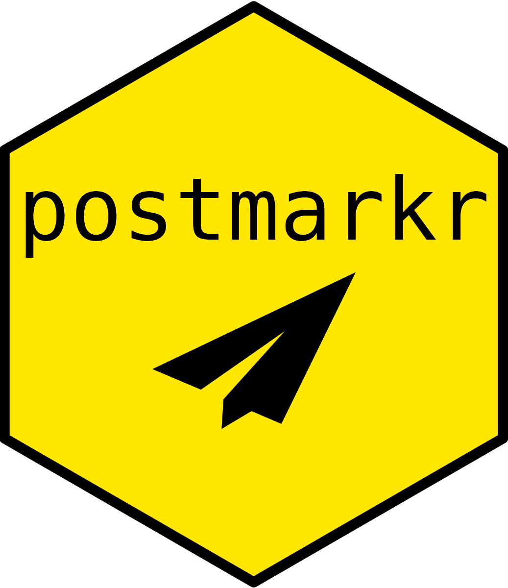

<!-- README.md is generated from README.Rmd. Please edit that file -->

```{r, include = FALSE}
knitr::opts_chunk$set(
  collapse = TRUE,
  comment = "#>",
  fig.path = "man/figures/README-",
  out.width = "100%"
)
```

# postmarkr 

<!-- badges: start -->

[](https://www.repostatus.org/#wip) [](https://github.com/nutrivetpet/postmarkr/actions/workflows/R-CMD-check.yaml) [](https://app.codecov.io/gh/nutrivetpet/postmarkr)

<!-- badges: end -->

The goal of postmarkr is to interact with the [Postmark API](https://postmarkapp.com/developer), from R.

It is an independent, community-developed R package for the [Postmark](https://postmarkapp.com) email service (**not created by or affiliated with Postmark**).

## Installation

You can install the development version of postmarkr like so:

``` r
pak::pak("nutrivetpet/postmarkr")
```

## Usage Patterns

postmarkr provides a clean, object-oriented API for sending emails through Postmark. The package supports two message types (email and template) and two delivery modes (individual and batch):

|   | `Email()` | `Template()` |
|------------------|------------------------|------------------------------|
| **Individual** | One email with HTML/text body | One email using template ID |
| **Batch** | Multiple custom emails (500+) | Multiple template emails (500+) |

### Individual Email (Custom Content)

Send a single email with custom HTML or text content:

```{r individual-email, eval=FALSE}
library(postmarkr)

# Create client
client <- Postmarkr(
  token = Sys.getenv("POSTMARK_SERVER_TOKEN"), 
  message_stream = "outbound"
)

# Create and send email
email <- Email(
  from = "sender@example.com",
  to = "recipient@example.com",
  subject = "Welcome to postmarkr",
  html_body = "<h1>Hello!</h1><p>Welcome to our service.</p>",
  track_opens = TRUE
)

result <- send(client, email)
```

### Individual Template Email

Send a single email using a predefined Postmark template:

```{r individual-template, eval=FALSE}
template <- Template(
  from = "notifications@example.com",
  to = "user@example.com",
  id = 36620093L,
  template_model = list(
    user_name = "Alice",
    company_name = "ACME Corp"
  ),
  track_opens = TRUE
)

result <- send(client, template)
```

### Batch Emails

Send multiple custom emails efficiently (automatically chunks into groups of 500):

```{r batch-email, eval=FALSE}
# Create multiple personalized emails
emails <- lapply(recipients, function(recipient) {
  Email(
    from = "sender@example.com",
    to = recipient,
    html_body = "<p>Hi %s, welcome aboard!</p>"
  )
})

# Wrap in batch and send
batch <- Batch(messages = emails)
result <- send(client, batch)
```

### Batch Templates

Send multiple template emails (e.g., newsletters, notifications):

```{r batch-template, eval=FALSE}
# Create template emails for each recipient
templates <- lapply(recipients, function(recipient) {
  Template(
    from = "newsletter@example.com",
    to = recipient,
    id = 36620093L,
    template_model = list(
      user_name = "Alice",
      company_name = "ACME Corp"
    )
  )
})

# Wrap in batch and send
batch <- Batch(messages = templates)
result <- send(client, batch)
```

## Features

-   **Custom Emails**: Compose emails with HTML or text using `Email()`
-   **Template Emails**: Use Postmark templates with variable substitution via `Template()`
-   **Batch Sending**: Efficiently send 500+ emails with `Batch()` (automatic chunking)
-   **Tracking**: Built-in support for open and click tracking

**Note:** Postmark API coverage is limited. See the [documentation](https://nutrivetpet.github.io/postmarkr/) for all available features.